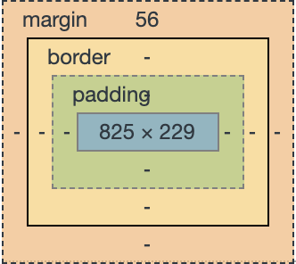

## 請找出三個課程裡面沒提到的 HTML 標籤並一一說明作用。
1.  ``` <video>```：嵌入影片
    * src : 影片來源，和  使用方式相同
    * controls : 顯示標準 HTML5 影片播放控制條及按鈕
    * autoplay : 影片自動播放
    * loop : 影片循環播放
    ```
    <video src="videoFile.mp4" controls autoplay loop />
    ```
2.  ```<b>```：文字粗體效果
    ```
     <b>要顯示粗體的內容</b>
    ```
3.  ```<script>```：放入 JavaScript 程式碼
    ```
     <script type="text/javascript">
        document.write("Hello World!")
     </script>

    ```

## 請問什麼是盒模型（box modal）
<br>
用 html 標籤切出來的東西可以視為一個四方盒狀的區塊，這個區塊就是盒模型，也就是在 google dev tool 中可以看見如上圖的方框。<br>

1. margin : 外邊距，設定邊框外的距離，透明只能設置距離。

    * 同時設置四邊距離
        * margin : 上 右 下 左 ;　
        * margin : 上下 左右 ;　
        * margin : 上 左右 下 ;
        * margin : 四邊相同値 ;
    * 單獨設置四邊距離
        * margin-top : 上 ;　
        * margin-right : 右 ;　
        * margin-bottom : 下 ;
        * margin-left : 左 ;
    * 設置距離值有 auto、長度單位與 %
        * auto :　瀏覽器自行設
        * 長度單位 : 給定數字及單位，單位可以是 em、px、pt 等
        * % :　瀏覽器自行設定，與邊界元素有關

2. border : 邊框

    * 同時設置所有屬性
        * border: 邊框粗細 邊框顏色 邊框樣式 ;
    * 單獨設置屬性
        * border-width: 邊框粗細 ;
        * border-color: 邊框顏色 ;
        * border-style: 邊框樣式 ;

3. padding : 用來設置 content 與 border 間的距離

    * 同時設置四邊距離
        * padding : 上 右 下 左 ;　
        * padding : 上下 左右 ;　
        * padding : 上 左右 下 ;
        * padding : 四邊相同値 ;
    * 單獨設置四邊距離
        * padding-top : 上 ;　
        * padding-right : 右 ;　
        * padding-bottom : 下 ;
        * padding-left : 左 ;
    * 設置距離值有 auto、長度單位與 %
        * auto :　瀏覽器自行設
        * 長度單位 : 給定數字及單位，單位可以是 em、px、pt 等
        * % :　瀏覽器自行設定，與邊界元素有關

4. content : 本身內容大小

5. box model 實際在瀏覽器上的大小控制

    在討論 box model 時，一定一定需要知道 box-sizing，因為 padding 和 border 其實是往外面長的，所以最後在瀏覽器上看到的大小其實會是 content + padding + border，和使用者認為的 " 元素大小 " 與 盒模型中的 content 概念可能會存在有些出入，一般都會希望元素的寬高是固定的，然後 padding 和 border 是往內縮進的，但如果每次在 content、padding 或 border 的寬度大小有所變動時，都還要再另外計算才能使元素的寬高是固定的其實很麻煩，這時就可以利用最一開始提及的 box-sizing，box-sizing 可以固定給定條件（定義盒子的最外層到哪裡）下的元素大小，自動地去調整內層的大小。<br>
    
    * 屬性說明
      * box-sizing : content-box ; <br>
        其實就是最原始的設定，固定的盒子大小最外層為 content，padding 和 border 會增加元素本身的寬度
      * box-sizing : border-box ; <br>
        固定的盒子大小最外層為 border，padding 和 border 不會增加元素本身的寬度，利用這個屬性來固定最後在瀏覽器上看到的元素大小


## 請問 display: inline, block 跟 inline-block 的差別是什麼？
* display : block ; <br>
    元素會以區塊方式呈現，一個元素會自動佔滿整行，為原始預設值。
* display : inline ; <br>
    元素皆不換行，所有元素會出現在同一行，無法設定寬高、調整上下邊距不會影響其他元素。
* display : inline-block ; <br>
    元素皆不換行，所有元素會出現在同一行，但可像 block 設定寬高、調整上下邊距。

## 請問 position: static, relative, absolute 跟 fixed 的差別是什麼？
* position : static ; <br>
    預設值，不會被定位在頁面上特定位置，而是照瀏覽器預設配置定位在頁面上
* position : relative ; <br>
    被設置 relative 和 static 是一樣的，但 relative 會影響到子元素的定位。
* position : absolute; <br>
    元素的定位是根據上層的相對位置，上層則是找到非 static 屬性的上層來定位。    
* position : fixed; <br>
    會相對於瀏覽器視窗來定位，所以即使頁面滾動，元素還是會固定在相同的位置。


